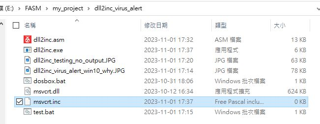

# dll2inc
original source code, https://board.flatassembler.net/topic.php?p=204766  

### build the exe, uses FASM 1.73.31
sometime win10 pops virus alert ? why ?
  

### dll2inc.exe assembled  

  

### testing is partially ok/failed
but msvcrt.inc has 0 bytes, nothing  

  

